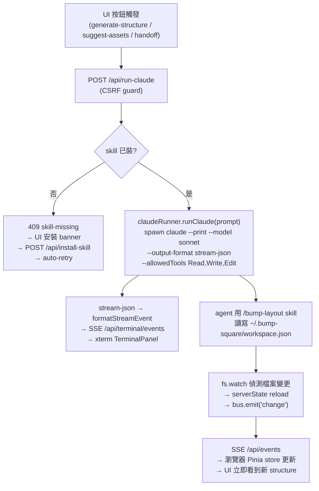

# bump-square

> 給 Claude 的專案說明。技術名詞用英文、路徑用實際檔名；不確定的請先讀程式碼或實際狀態再行動（見 user-level「No vibe answers」）。

## 目的

bump-square 是設計稿與「真正寫程式的 agent」之間的**意圖確認層 (intent layer)**，不是最終 codegen。

流程：使用者上傳設計截圖 → 在上面畫 Frame、寫 comment（意圖）→ 確認版面 → 由 agent 產生「意圖結構樹」→ 把一份 **markdown prompt 送交 (handoff)** 給開發 agent 去實作元件。

**agent = 由 dev server spawn 的 `claude --print`**（Claude Code CLI；使用者一次 `claude login` 即可，不需要 API key）。每次 UI 觸發動作（generate-structure / suggest-assets / handoff），server 起一個 `claude --print` 行程，帶 `/bump-layout` skill prompt，agent 直接讀寫 `~/.bump-square/workspace.json`；server 用 `fs.watch` 偵測檔案變更後再 SSE 推回瀏覽器。北極星：Figma + 人工意圖疊加 → agent build；bump-square 負責「確認/意圖」，不負責產出最終程式碼。

## 架構

單一真實來源在 server，瀏覽器與 `claude --print` 都讀寫同一份 `~/.bump-square/workspace.json`。

- `src/lib/serverState.ts` — **single source of truth**（module-scope，HMR-safe via `globalThis`）。持久化到 `~/.bump-square/workspace.json`（debounced atomic write，tmp + rename）；含 undo/redo 快照堆疊（board only，上限 30）。**`fs.watch` 監聽該目錄**：若檔案被外部（`claude --print`）改動就 reload + 廣播給瀏覽器（自寫時用 `_suppressWatch` flag 避免迴圈）。
- `src/pages/api/events.ts` — **SSE** `/api/events`，把權威狀態（+ `canUndo/canRedo`）推給瀏覽器。
- `src/pages/api/state.ts` — **瀏覽器 → server** 的 mutation（`action` + `payload`）。CSRF guard。
- `src/pages/api/run-claude.ts` — **瀏覽器 → server** 觸發 agent：`POST { kind: 'generate-structure' | 'suggest-assets' | 'handoff' }`，CSRF guard，回 `202` 後立即 spawn。Pre-flight 檢查 `~/.claude/skills/bump-layout/SKILL.md` 存在；不存在回 `409 skill-missing`，UI 顯示安裝 banner。
- `src/lib/claudeRunner.ts` — 管理 `claude --print` lifecycle（**同時只跑一個**，後續排 queue）。固定 args：`--model sonnet --output-format stream-json --verbose --allowedTools Read,Write,Edit`。stream-json 一行一個事件，`formatStreamEvent()` 把它翻成 xterm-friendly 進度行（drop hook 噪音；assistant 文字直出；tool_use → `🛠 ToolName <target>`；tool_result 沉默除非 error），同時推進 circular buffer（最多 10000 行）與 SSE bus。
- `src/pages/api/terminal/events.ts` — SSE `/api/terminal/events`，連線時 replay buffer，之後 live push chunks／clear／status（running 狀態）。chunk 用 base64 encode（避開 SSE 換行問題）。
- `src/pages/api/install-skill.ts` — `POST`，把 repo 內 `skills/bump-layout/SKILL.md` copy 到 `~/.claude/skills/bump-layout/SKILL.md`（idempotent）。CSRF guard。
- `skills/bump-layout/SKILL.md` — `claude --print` 真正讀的 skill：`/bump-layout` 指令告訴 agent 讀 `~/.bump-square/workspace.json`、依 containment + comment 產生 structure、直接寫回該檔案。**只允許動 workspace.json**（handoff 操作除外）；JSON 寫檔禁用 `Edit` 工具（用 Read + Write）。
- `src/components/TerminalPanel.vue` — 底部 xterm.js readonly panel（`disableStdin: true`，FitAddon），預設收起，header `>_` 按鈕切換；首次 `terminalRunning` 自動展開一次（之後使用者關了就不再自動開）；高度 240px 可拖。
- `src/components/SkillInstallBanner.vue` — 偵測 `store.skillMissing`，顯示「一鍵安裝 bump-layout skill」banner，POST `/api/install-skill` → 清掉 flag → store 自動 retry 原本的 run。
- `src/lib/imageStore.ts` — 圖片存 `~/.bump-square/uploads/<uuid>.<ext>`，狀態只存 filename 引用；用 `/api/image/[name]` 回傳。
- `src/lib/saveStore.ts` — 具名存檔 `~/.bump-square/saves/<id>.json`（只存 board，不含 agent log）。
- `src/lib/containment.ts` — 幾何包含關係（結構樹的依據）。
- `src/lib/guard.ts` — `crossOriginBlocked()`：用 `Sec-Fetch-Site` 擋跨站 POST，避免使用者開到惡意網頁就被 RCE（任意 `claude --print`）。
- `src/stores/workspace.ts` — Pinia store，瀏覽器端的唯讀鏡像 + dispatch；`runAgentKind(kind)` 打 `/api/run-claude`，409 時把 `skillMissing` 記下、安裝完自動 retry。
- `src/composables/` — WorkspaceCanvas 的邏輯拆成三個 composable（元件本身只剩 wiring + template）：
  - `useViewport.ts` — zoom／pan／fit／focus／1:1（座標數學在 `lib/viewport.ts`，這裡是 reactive glue：container size、auto-fit、wheel zoom）。
  - `useFrameInteractions.ts` — 畫框／pan／resize（8 handle）／拖移群組／copy-cut-paste，含幾何 helper（`screenRect`／`imgStyle`／z-stacking／ghost preview）與統一 pointer handlers。
  - `useNotesRail.ts` — Notes rail 的 leader line（hover + 選取兩種）、浮動 label 排版、`notesOpen`／`showLabels`。

`~/.bump-square/` 與 `.bump-square/`（rare local override）整個 gitignore。

### 已移除的舊架構（commits 0bd570e → 0f0013b）

- ❌ `mcp/server.ts`（MCP stdio bridge）
- ❌ `.mcp.json`（自動 spawn MCP）
- ❌ `src/pages/api/mcp.ts`（MCP → HTTP 轉發 endpoint）
- ❌ fakechat 門鈴鏈：`ringFakechat`、`DoorbellStatus.vue`、`<channel source="fakechat">` 流程
- ❌ `agentRequests` queue（server 排隊 + agent 拉取的舊模型）
- ❌ `claude --channels plugin:fakechat@claude-plugins-official` 啟動需求

新流程不需要 API key、不需要常駐 session、不需要 fakechat singleton port。

## Tech stack

- **Astro 6**（`output: 'server'`，Node standalone adapter）+ **Vue 3** islands（`<script setup lang="ts">`）+ **Pinia** + **UnoCSS**（`presetWind4`，對齊原本的 Tailwind v4／oklch 色票與 v4 reset；`@unocss/astro` integration + `uno.config.ts`）。
- **Vite**、**pnpm**、Node ≥ 22（實際跑 24）。**TypeScript** + `@types/node`；`pnpm exec tsc --noEmit` 可型別檢查。
- `@xterm/xterm` + `@xterm/addon-fit`（terminal panel）、`zod`、`uuid`、`sharp`、`konva` / `vue-konva`、`markdown-it`（Structure 的 Prompt 預覽渲染，`html:false` 防 XSS）。
- Dev server **port 固定 4399**（`astro.config.mjs`）。
- **CLI 依賴**：`claude`（Claude Code CLI）必須在 PATH 上、已 `claude login`。`claudeRunner` 用 `spawn('claude', ...)`；找不到會在 terminal 顯示 spawn error。

UnoCSS 注意事項：用 `presetWind4({ preflights: { reset: true } })` 還原原本 Tailwind v4 的樣子（oklch 色票 + 內建 v4 reset，含全域 `border:0 solid` 讓 `border-2`/`border-4` 這類「只設寬度」的 utility 看得到框）。**改用 `presetWind3` 會踩雷：v3 不設全域 `border-style`，所有 `border-N` 變透明 → 框線全部消失。** 自訂 reset／`<button>` 背景／`.no-scrollbar` 放在 `uno.config.ts` 的 `preflights`；共用樣式用 `shortcuts`（`btn` / `btn-primary` / `btn-neutral` / `icon-btn`）。Astro `<style>` 是 scoped，全域樣式要 `is:global`。**pnpm 坑**：`unocss/astro` 內部 re-export `@unocss/astro`，pnpm 巢狀下從專案根解不到 → 直接 `pnpm add -D @unocss/astro` 並 import `@unocss/astro`。

## Permissions / 啟動

- **啟動指令**：`pnpm dev`（:4399）。**不需要 `--channels` flag**，不需要任何特殊 session 模式。
- **前置一次性設定**：使用者跑 `claude login`（支援 Google OAuth），確保 `claude` 在 PATH 上。
- **bump-layout skill 安裝**：app 第一次按「產生意圖結構」時 `/api/run-claude` 回 `409 skill-missing`，UI 顯示安裝 banner，按一下 POST `/api/install-skill` 把 repo 內 `skills/bump-layout/SKILL.md` 複製到 `~/.claude/skills/bump-layout/SKILL.md`。也可 `pnpm run setup` 額外裝一份 ops skill（`/bump-square`，幫使用者快速 health-check + 起 dev server，跟 agent 流程無關）。
- **agent 工具範圍**：`claudeRunner` 固定加 `--allowedTools Read,Write,Edit`，skill 本身規定只動 workspace.json（handoff 時例外可在 `~/Documents/Projects` 下建/改元件專案）。`~/.claude/settings.json` 的 `permissions.additionalDirectories` 加 `~/Documents/Projects` 讓 spawn 出來的 claude 能在那裡寫檔（若 `/home` 是 `/var/home` 的 symlink，兩種前綴都列）。
- **同時只跑一個 `claude --print`**：第二次觸發會 queue。
- **CSRF**：`/api/run-claude`、`/api/install-skill`、`/api/state` 都檢查 `Sec-Fetch-Site`（`src/lib/guard.ts`）。

## 功能說明

工作流三步：`upload → layout → structure`（header 的 chevron 麵包屑可切換）。

- **Upload** — 上傳設計截圖。
- **Layout (WorkspaceCanvas)** — 在圖上畫 Frame、標註意圖：
  - `comment`（使用者意圖）/ `aiNote`（agent 推斷，唯讀、與 comment 形成雙重確認）。
  - Frame 互動：選中粗紫框、8 向 resize handle、**拖框身移動**（容器連內部一起搬，依 containment）、**⧉ 複製**（含內部，置於下方）。
  - **Ctrl+C/X/V 點擊放置**：複製/剪下選中框 → Ctrl+V 進入放置模式（幽靈預覽跟游標、點擊落點、Esc 取消）。
  - **Undo/Redo**：工具列 ↶↷ + Ctrl+Z / Ctrl+Shift+Z / Ctrl+Y（全 board 操作，agent log 不進 history）。
  - 框依**面積排 z-index**（小框在上，可點進內層）。
  - Notes rail：單擊改名、✏/⧉/✕；浮動標籤可切換顯示。**選中 Frame 會畫一條虛線 leader line 指到它在 Notes rail 的編輯列**（提示去哪寫意圖；隨 zoom/pan/scroll 即時跟動）。
  - `🧩 產生意圖結構` → 觸發 `generate-structure`：POST `/api/run-claude` → spawn `claude --print`（terminal panel 首次自動展開）→ agent 寫回 workspace.json → fs.watch 偵測 → SSE 推新 structure 給瀏覽器。
  - **Reset（header）** 兩段式確認：第一下變紅「確定清空？」，3 秒內再按一次才真的清空。
- **Structure (StructureView)** — 兩個 tab：
  - **Tree**：可收合的結構樹（圓形 +/− toggle、連接線）。
  - **Prompt**：markdown 渲染（**預覽/原始碼** toggle 可編輯）；內容＝`## 結構`（code-fence 樹狀）+ `## 節點說明`（清單）+ 選配 `## Assets 生成 prompt`。
  - `✨ 生成 assets prompt` → 觸發 `suggest-assets`；`🚀 送交開發` → 觸發 `handoff`（agent 在 `~/Documents/Projects` 下實作元件，目前範例專案 `bump-square-widge`）。
- **💾 存檔（SavesMenu，header）** — 多組具名存檔，可載入/刪除；只存 board，不含 agent log。
- **`>_` Terminal 面板（header）** — 底部 xterm readonly panel 顯示 `claude --print` 即時輸出；預設收起、首次跑時自動展開一次；按鈕右上有 pulsing dot 表示「跑中但 panel 關著」。

## 操作方式（agent / `claude --print` 視角）

被 dev server spawn 時收到的 prompt 開頭是 `/bump-layout`，下面接 `workspace: <絕對路徑>` + 操作描述。**真實檔案路徑以 prompt 中的 `workspace:` 為準**（會是 `~/.bump-square/workspace.json` 的展開）。

1. **讀 `workspace.json`**（用 `Read` 工具）— `squares[]` 是 frames、`structure` 是要寫回的目標。
2. 依 `kind` 處理：
   - `generate-structure` → 依 containment + 各框 `comment` 組出意圖結構樹 → 寫 `structure.tree` + `structure.prompt` + `structure.assetsPrompt: null`。重複的子結構可收斂成「範本 ×N」（列表/資料驅動意圖）。沒 comment 的框，型別用推斷並標 `（推斷）`、**不杜撰使用者意圖**。
   - `suggest-assets` → 依現有 `structure.tree` 推敲每節點需要的視覺素材，寫成 markdown 進 `structure.assetsPrompt`（不動 tree/prompt）。
   - `handoff` → prompt 內含完整 markdown spec；在 `~/Documents/Projects` 下實作對應元件（Vue 3 + Vite + TS）。**不要動 workspace.json**。
3. **JSON 寫檔用 `Read` + `Write`，不要用 `Edit`**（Edit 容易把 JSON 改壞）。
4. 結束時用繁中印出做了什麼的一行摘要 — `claudeRunner` 會把這行流進 xterm 給使用者看。

開發指令：`pnpm dev`（:4399）、`pnpm build`、`pnpm run setup`（裝 `/bump-square` ops skill，可選）。
