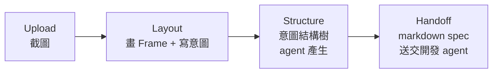
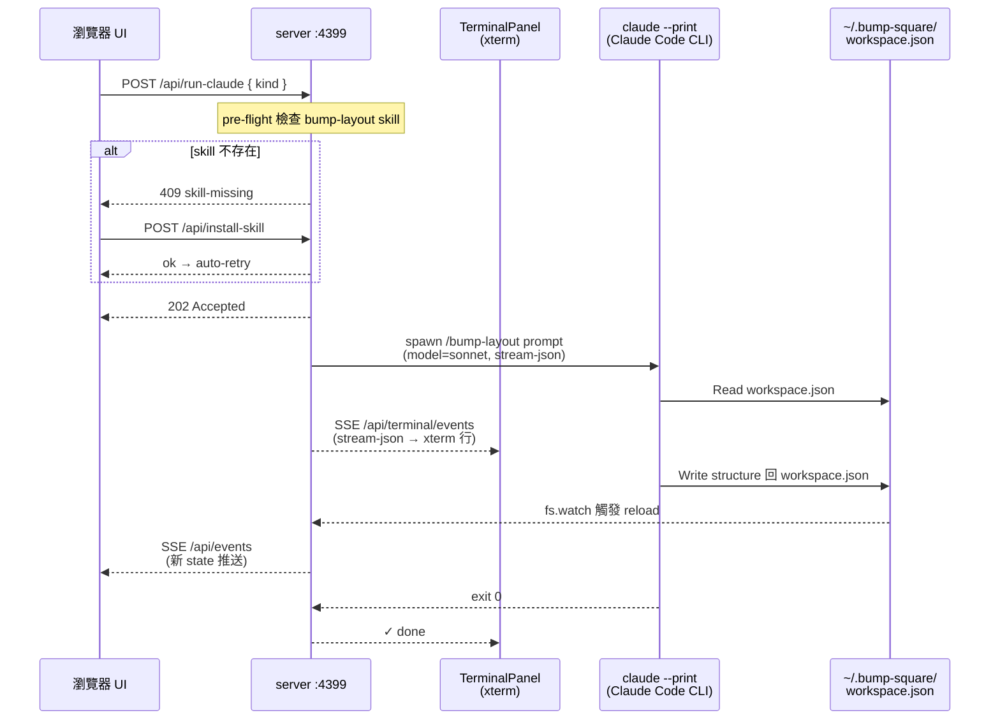
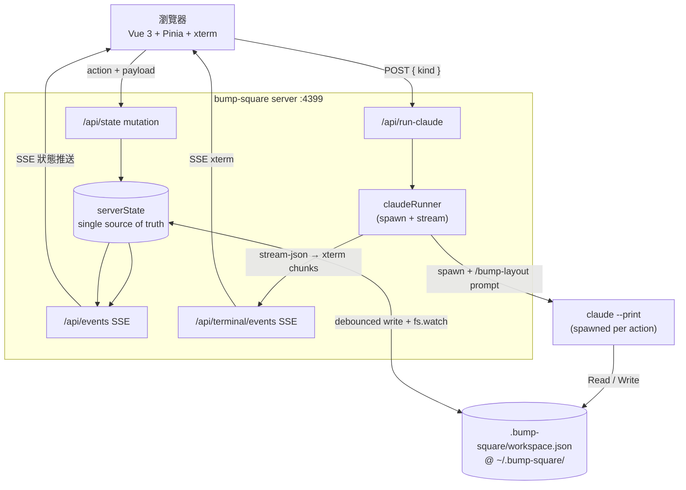

<p align="center">
  
</p>

# bump-square

> 設計稿與「真正寫程式的 agent」之間的**意圖確認層 (intent layer)**。

bump-square 不做最終 codegen。它讓你在設計截圖上畫出版面、寫下意圖，確認後由 agent
整理成「意圖結構樹」，再把一份 **markdown prompt 送交 (handoff)** 給下游的開發 agent。

bump-square 的職責**終點就是這份意圖 spec**——下游 agent / developer 拿它去產出什麼
（元件程式碼、別的設計、文件……）由對方決定，**不見得是程式碼**，也不屬於本專案範圍。

**北極星**：Figma 提供視覺真實（顏色、間距、尺寸、層級），bump-square 提供意圖真實
（重複、響應式、變體、互動、結構意義）。bump-square 負責「確認 / 意圖」，把確認過的意圖交棒出去。

## 流程



1. **Upload** — 上傳設計截圖。
2. **Layout** — 在圖上畫 Frame、標註 `comment`（你的意圖）；agent 可加唯讀 `aiNote`（推斷）形成雙重確認。
3. **Structure** — agent 依幾何包含關係 + 各框 comment 組出可收合的結構樹，並渲染成可編輯的 markdown prompt。
4. **Handoff** — 把編輯後的意圖 spec 交棒給下游 agent / developer（產出由對方決定）。

每次按 UI 上的 agent 按鈕，dev server 會 spawn 一個 `claude --print` 行程
（搭配 `/bump-layout` skill），直接讀寫 `~/.bump-square/workspace.json`；server 用
`fs.watch` 偵測檔案變更後 SSE 推回瀏覽器。底部 xterm panel 顯示 agent 即時輸出。

## 需求

- **Node ≥ 22**（實際以 24 測試）
- **pnpm**（沒有的話 `install.sh` 會用 corepack 啟用）
- **Claude Code CLI**（agent 流程用）— 第一次需 `claude login`（支援 Google OAuth），之後不需 API key

## 安裝

```bash
git clone <repo-url> bump-square
cd bump-square
pnpm install        # 相依套件（跨平台）
pnpm run setup      # 可選：裝 /bump-square ops skill 到 ~/.claude/skills/
```

`pnpm run setup` 只裝 `/bump-square` ops skill（給人用：health-check、起 dev server）。
**agent 真正需要的 `bump-layout` skill 由 app 第一次跑時自動安裝**——按下「產生意圖結構」會偵測
skill 缺失並顯示一鍵安裝 banner（從 repo 內 `skills/bump-layout/SKILL.md` 複製到
`~/.claude/skills/bump-layout/SKILL.md`）。安裝器是 Node 寫的（`scripts/install.mjs`），跨平台。

## 使用

```bash
pnpm dev            # dev server → http://localhost:4399
pnpm build          # 產生 production build
```

**不需要 `claude --channels` 之類的特殊啟動模式**——dev server 自己會在每次 agent 動作時 spawn `claude --print`。

### Agent 流程時序圖



## 架構

單一真實來源是 `~/.bump-square/workspace.json`，瀏覽器與 `claude --print` 都讀寫同一份。

| 檔案 | 角色 |
|---|---|
| `src/lib/serverState.ts` | **single source of truth**；持久化到 `~/.bump-square/workspace.json`（debounced atomic write），含 undo/redo；**`fs.watch` 偵測外部寫入**並廣播 |
| `src/pages/api/events.ts` | **SSE** `/api/events`，把權威狀態推給瀏覽器 |
| `src/pages/api/state.ts` | 瀏覽器 → server 的 mutation |
| `src/pages/api/run-claude.ts` | 瀏覽器 → server 觸發 agent；組 `/bump-layout` prompt、spawn `claude --print` |
| `src/lib/claudeRunner.ts` | `claude --print` lifecycle（同時只跑一個，後續排 queue）；解析 stream-json、餵給 xterm |
| `src/pages/api/terminal/events.ts` | SSE `/api/terminal/events`，把 xterm chunks 推給 `TerminalPanel` |
| `src/pages/api/install-skill.ts` | 把 `skills/bump-layout/SKILL.md` 複製到 `~/.claude/skills/`（idempotent） |
| `skills/bump-layout/SKILL.md` | `/bump-layout` skill：`claude --print` 用它讀寫 `workspace.json` |
| `src/components/TerminalPanel.vue` | 底部 xterm readonly panel（首次跑時自動展開） |
| `src/components/SkillInstallBanner.vue` | skill 缺失時的一鍵安裝 banner |
| `src/lib/containment.ts` | 幾何包含關係（結構樹的依據） |
| `src/stores/workspace.ts` | Pinia store，瀏覽器端唯讀鏡像 + dispatch |
| `.claude/skills/bump-square/` | 可選 ops skill（`/bump-square` 幫使用者起 dev server + health-check） |

### 資料流



**Tech stack**：Astro 6（SSR, Node standalone）+ Vue 3 islands + Pinia + UnoCSS（presetWind4）、
Vite、TypeScript、xterm.js。Agent 用 Claude Code CLI（`claude --print`），不需要 Anthropic API key。

API 為 localhost-only，state-mutating endpoint（`/api/state`、`/api/run-claude`、`/api/install-skill`）
以 `Sec-Fetch-Site` 做 CSRF guard（見 `src/lib/guard.ts`）——沒這個守則，使用者開到惡意網頁就能
跨站觸發任意 `claude --print` 執行。`.bump-square/`（持久化狀態、上傳圖片、存檔）整個 gitignore。

開發者導向的完整說明（agent 操作協定、stream-json 過濾、檔案監看細節）見 [`CLAUDE.md`](./CLAUDE.md)。

## License

[MIT](./LICENSE) © 2026 silencechung
