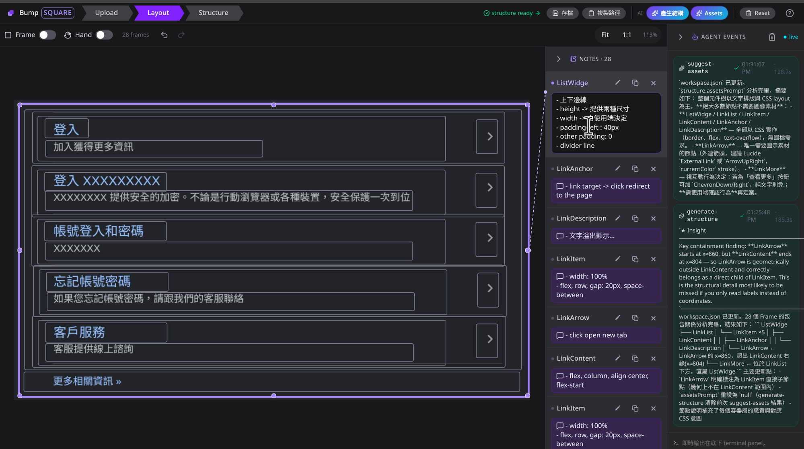
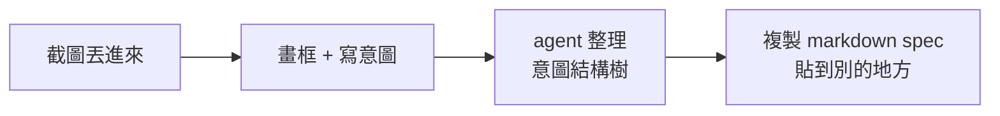

<p align="center">
  
</p>

# bump-square

> 我自己用的小工具:畫一張設計截圖,在上面寫意圖,讓 agent 整理成結構,然後把那份意圖**複製給寫 code 的人 / 另一隻 agent**。本身不寫 code。

## 為什麼會有這東西

我畫設計稿的時候,常覺得「跟 AI 解釋想法」這段很煩。它從 Figma 拿得到顏色、尺寸、間距,
但看不出「這個 row 其實是 list、不是單一框」、「mobile 版這個 button 要變 drawer」、
「這四塊重複的東西是 v-for,不是手刻」這種**意圖**。

所以這個工具讓我:

1. 截圖丟上來
2. 在截圖上畫框、每塊寫一句「我想要什麼」
3. 按一下,agent 把意圖整理成可收合的結構樹 + 一份 markdown spec
4. 複製 spec → 貼給寫 code 的 agent / 朋友 / 未來健忘的我

意思就是,**它的職責終點是那份 spec**。產不產 code、產什麼 code、誰來產,跟它無關。

## 長這樣



中間那塊就是 Layout 步驟:把設計稿當底圖、在上面畫框、右邊 Notes rail 一塊寫一句意圖
(例如 `LinkArrow → click open new tab`、`ListWidge → 上下邊線 / height: 兩種尺寸 / padding-left: 40px`)。
按 `🧩 產生結構` 後,agent 會根據框的包含關係 + 你寫的 comment 整理成結構樹,
寫進右側 Agent Events panel 看得到的那份 markdown spec。

## 流程



每按一次「產生意圖結構」之類的按鈕,dev server 會 spawn 一個 `claude --print` 行程
(吃 `/bump-layout` skill),讀寫 `~/.bump-square/workspace.json`。底下 xterm panel
看得到 agent 即時在幹嘛。沒在跑 agent 的時候,你看到的就是純前端。

## 你需要

- **Node ≥ 22**(我自己跑 24)
- **pnpm**
- **Claude Code CLI** — 第一次 `claude login`(支援 Google OAuth),之後不用 API key
- 一張你想動腦的截圖

## 裝起來

```bash
git clone <repo-url> bump-square
cd bump-square
pnpm install
```

第一次按「產生意圖結構」時,如果偵測到缺 `bump-layout` skill,會顯示一鍵安裝 banner
把 repo 內 `skills/bump-layout/SKILL.md` 複製到 `~/.claude/skills/`。**你不用手動裝**。

`pnpm run setup` 是另一個可選步驟,裝給人用的 `/bump-square` ops skill(幫你快速
health-check + 起 dev server,跟 agent 流程無關)。沒裝也能用。

## 跑起來

```bash
pnpm dev       # http://localhost:4399
pnpm build     # production build
```

不需要任何 `--channels` 之類的特殊啟動模式,純跑 dev server 就好。

## 想看細節

開發者文件、agent 操作協定、檔案監看邏輯、stream-json 過濾、CSRF guard、xterm panel
怎麼跟 agent 串起來這些都寫在 [`CLAUDE.md`](./CLAUDE.md)。那邊是正常的技術文件 tone。

## 一些安全相關的事

- API 都是 localhost-only。state-mutating endpoint (`/api/state`、`/api/run-claude`、
  `/api/install-skill`) 用 `Sec-Fetch-Site` 擋跨站 POST(`src/lib/guard.ts`)。沒這個,
  你開到惡意網頁就會被跨站觸發任意 `claude --print` 執行 ≈ RCE。
- `~/.bump-square/`(持久化狀態、上傳圖片、存檔)整個 gitignore。
- agent 的 `--allowedTools` 預設只給 `Read,Write,Edit`,沒 Bash。要加可以在
  `~/.bump-square/config.json` 自己覆寫,但**沒有任意 extra-args 逃生口**,避免覆寫掉這條安全網。

## License

[MIT](./LICENSE) © 2026 silencechung
