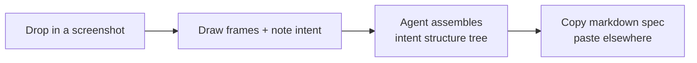

<p align="center">
  
</p>

<p align="center">
  
  = 22">
  
  
</p>

# Bump Square

> 我自己用的小工具:畫一張設計截圖,在上面寫意圖,讓 agent 整理成結構,然後把那份意圖**複製給寫 code 的人 / 另一隻 agent**。本身不寫 code。
>
> A small tool I built for myself: drop in a design screenshot, jot your intent on each frame, let an agent shape it into a structure tree, then **copy that intent to a human dev / another agent**. The tool itself never writes code.

> ⚠️ **silencechung 的個人工具**:`workspace.json` schema 跟 HTTP API 還會變,不是 stable 釋出。
>
> ⚠️ **A personal tool by silencechung** — the `workspace.json` schema and the HTTP API are still moving; not a stable release.

## 為什麼會有這東西 / Why this exists

我畫設計稿的時候,常覺得「跟 AI 解釋想法」這段很煩。它從 Figma 拿得到顏色、尺寸、間距,
但看不出「這個 row 其實是 list、不是單一框」、「mobile 版這個 button 要變 drawer」、
「這四塊重複的東西其實是同一個元件 list(例如 `v-for`),不是手刻四份」這種**意圖**。

When I'm working on a design, the part where I have to explain my thinking to an AI is the
annoying bit. It can pull colors, sizes, and spacing from Figma — but it can't see
**intent**: "this row is actually a list, not one box", "on mobile this button becomes a
drawer", "these four repeating chunks are one repeating component (e.g. `v-for`), not
hand-rolled".

所以這個工具讓我:

1. 截圖丟上來
2. 在截圖上畫框、每塊寫一句「我想要什麼」
3. 按一下,agent 把意圖整理成可收合的結構樹 + 一份 markdown spec
4. 複製 spec → 貼給寫 code 的 agent / 朋友 / 未來健忘的我

So this tool lets me:

1. Drop a screenshot in
2. Draw frames on it and write one sentence of intent per frame
3. Hit a button — an agent turns it into a collapsible structure tree + a markdown spec
4. Copy the spec → paste it to the coding agent / a friend / future-forgetful-me

簡單講,**它做到那份 spec 就交差了**。後面要不要拿去產 code、產什麼樣、誰去產 — 它都不管。

Short version: **it ships when the spec is ready**. Whether anyone turns it into code,
what code, who does it — none of bump-square's business.

## 長這樣 / What it looks like


中間那塊就是 Layout 步驟:把設計稿當底圖、在上面畫框、右邊 Notes rail 一塊寫一句意圖
(例如 ``LinkArrow → click open new tab``、``ListWidget → 上下邊線 / `height`: 兩種尺寸 / `padding-left`: 40px``)。
Comment 編輯器在你打 `` `flex` ``、`` `padding-left` `` 之類的 backtick-wrapped token 時
會把它變成紫色 chip,順便有 ~250 條 HTML / CSS / Tailwind 字典 popup 提示 — 在 terminal /
非 IDE 環境寫意圖、語法記不全時用。按 `✨ 產生 Spec` 後,agent 一次性根據框的包含關係 +
你寫的 comment 組出結構樹 + 節點說明 + assets 推論,整份 spec 寫進 Structure tab。

The middle is the Layout step: the design is the backdrop, you draw frames on top, and
the Notes rail on the right gets one line of intent per frame (e.g. ``LinkArrow → click
open new tab``, ``ListWidget → top/bottom border / `height`: 2 sizes / `padding-left`: 40px``).
The comment editor turns backtick-wrapped tokens like `` `flex` `` or `` `padding-left` ``
into inline purple chips, with a ~250-entry HTML / CSS / Tailwind autocomplete popup
for when you're typing intent away from an IDE and can't remember the exact name. Hit
`✨ Generate Spec` and the agent assembles the full spec in one pass — structure
tree + per-node descriptions + assets suggestions — written into the Structure tab.

## 流程 / Flow



每次按 [產生 Spec] 之類的 AI 按鈕,dev server 就 spawn 一隻 `claude --print` 出去
(吃 `/bump-layout` skill),讀寫 `~/.bump-square/workspace.json`。底下 xterm panel
看得到 agent 即時在幹嘛。沒在跑 agent 的時候,看到的就是純前端。

Hitting an AI button like "Structure" makes the dev server spawn a `claude --print`
process (loading the `/bump-layout` skill) that reads / writes
`~/.bump-square/workspace.json`. The bottom xterm panel streams what the agent's doing.
When nothing's running, you're just looking at the frontend.

## 你需要 / What you need

- **Node ≥ 22**(我自己跑 24 / I run 24)
- **pnpm**
- **Claude Code CLI** — 第一次 `claude login`(支援 Google OAuth),之後不用 API key  
  First time `claude login` (Google OAuth supported), no API key after that
- 一張你想動腦的截圖 / A screenshot worth thinking about

## 裝起來 / Install

```bash
git clone https://github.com/silencechung/bump-square.git
cd bump-square
pnpm install
```

第一次按 [產生 Spec] 的時候,如果 `bump-layout` skill 還沒裝,會跳出一鍵安裝 banner
把 repo 裡的 `skills/bump-layout/SKILL.md` 複製到 `~/.claude/skills/`。**手動裝完全不用**。

First time you press [Structure], if the `bump-layout` skill isn't installed yet, a
one-click banner copies `skills/bump-layout/SKILL.md` from the repo into
`~/.claude/skills/`. **No manual install step.**

另外 `pnpm run setup` 可選,裝一個給人用的 `/bump-square` ops skill(幫你 health-check
+ 起 dev,跟 agent 流程無關)。沒裝也跑得起來。

Optional: `pnpm run setup` installs the `/bump-square` ops skill (a health-check +
dev-server helper for humans, separate from the agent flow). Skip it and the app still
runs fine.

## 跑起來 / Run

```bash
pnpm dev       # http://localhost:4399
pnpm build     # production build
```

開好瀏覽器丟截圖進去就開工。右上角 `繁 / EN` 切換 UI 語言。

Open it in your browser, drop a screenshot in, start working. The `繁 / EN` toggle at
the top-right switches the UI language.

## 設定 / Config

選配。想覆寫預設就在 `~/.bump-square/config.json` 開一個 JSON,只放想改的欄位
(shallow merge,沒寫到的吃 default;檔案不存在也 OK)。每次按 AI 按鈕都會重讀,改完
不用 restart。

Optional. To override defaults, put a JSON file at `~/.bump-square/config.json` with
just the fields you want to change (shallow-merged onto defaults; missing fields fall
back; the file itself is optional). Re-read on every AI button press — no restart
needed.

```jsonc
{
  "claude": {
    // 'haiku' (default) / 'sonnet' / 'opus' / 任何 Claude Code 吃的 model 字串
    // 'haiku' (default) / 'sonnet' / 'opus' / any model string Claude Code accepts
    "model": "haiku",

    // 傳給 `claude --print --allowedTools` 的工具清單。預設不含 Bash;
    // 要加自己加 — 但這是安全網,慎重(見下面 Security notes)。
    // Tools passed to `claude --print --allowedTools`. No Bash by default;
    // widen deliberately — this is the safety net (see Security notes below).
    "allowedTools": ["Read", "Write", "Edit"],

    // 'stream-json' (default,xterm panel 需要) | 'text'
    // 'stream-json' (default — required by the xterm panel) | 'text'
    "outputFormat": "stream-json",

    // stream-json 需要 verbose。改 outputFormat: 'text' 才考慮關。
    // stream-json requires verbose. Only turn off if outputFormat is 'text'.
    "verbose": true
  },
  "ui": {
    // 'zh-TW' (default) | 'en'。Header 的 繁/EN 切換會直接寫回這欄。
    // 'zh-TW' (default) | 'en'. The header 繁/EN toggle writes here directly.
    "locale": "zh-TW"
  }
}
```

只收上面這些 typed 欄位。塞 `extraArgs` / `args` / 自訂 flag 陣列**會被忽略**,
這是故意的(見 Security notes)。

Only the typed fields above are accepted. Putting `extraArgs` / `args` / a custom flag
array in there **will be silently ignored** — by design (see Security notes).

## 想看細節 / Want the technical detail

開發者文件、agent 操作協定、檔案監看邏輯、stream-json 過濾、CSRF guard、xterm panel
怎麼跟 agent 串起來這些都寫在 [`CLAUDE.md`](./CLAUDE.md)。**那份是寫給 AI agent 看的
instruction tone**(人類讀沒問題,但語氣會比較硬、有些指令性的口氣)。

Developer docs, agent protocol, file-watch logic, stream-json filtering, CSRF guard, how
the xterm panel hooks into the agent — all in [`CLAUDE.md`](./CLAUDE.md). **Heads-up:**
that file is written as instructions for AI agents (human-readable, but the tone is
terser and more directive than a typical README).

## 一些安全相關的事 / Security notes

- API 都是 localhost-only。state-mutating endpoint (`/api/state`、`/api/run-claude`、
  `/api/install-skill`) 用 `Sec-Fetch-Site` 擋跨站 POST(`src/lib/guard.ts`)。沒這個,
  你開到惡意網頁就會被跨站觸發任意 `claude --print` 執行 ≈ RCE。
- `~/.bump-square/`(持久化狀態、上傳圖片、存檔)整個 gitignore。
- agent 的 `--allowedTools` 預設只給 `Read,Write,Edit`,沒 Bash。要加可以在
  `~/.bump-square/config.json` 自己覆寫,但**沒有任意 extra-args 逃生口**,避免覆寫掉這條安全網。

---

- All APIs are localhost-only. State-mutating endpoints (`/api/state`, `/api/run-claude`,
  `/api/install-skill`) use `Sec-Fetch-Site` to block cross-origin POSTs
  (`src/lib/guard.ts`). Without that guard, visiting a malicious page could trigger
  arbitrary `claude --print` runs ≈ local RCE.
- `~/.bump-square/` (persistent state, uploaded images, named saves) is fully
  gitignored.
- The agent's `--allowedTools` defaults to `Read,Write,Edit` — no `Bash`. You can widen
  this in `~/.bump-square/config.json`, but **there is no arbitrary-extra-args escape
  hatch** by design — that would let an override bypass this safety net.

## License

[MIT](./LICENSE)
